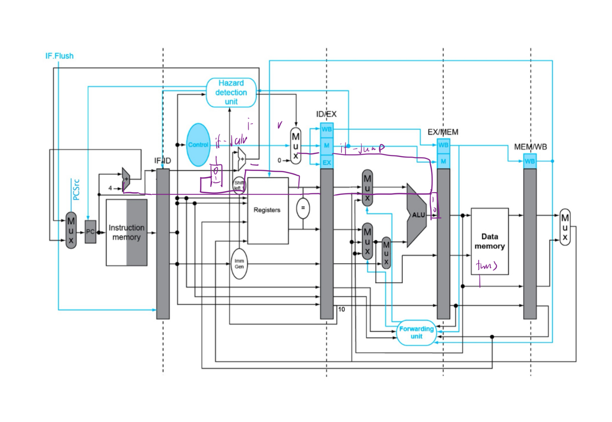
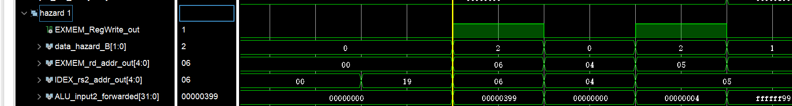
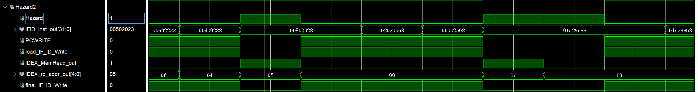
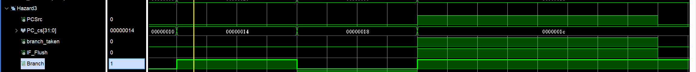
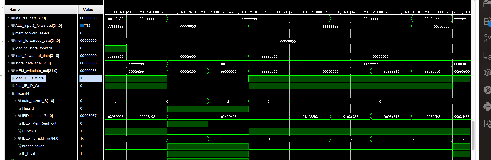
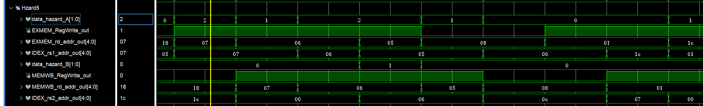
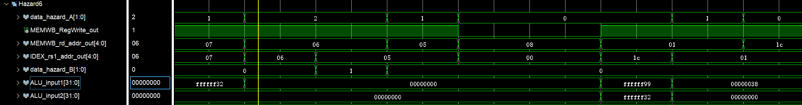
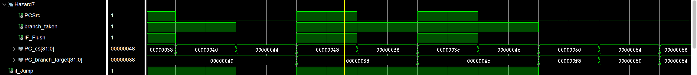
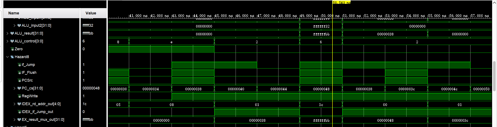
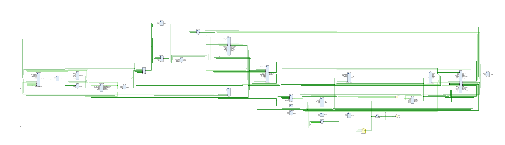

# VE370_Lab4
Group 2: Huang Han, Ye Zixin, Yuan Haotong

## Modeling and Implementation
Based on the pipeline done in Lab 3, we have added hazard detection mechanisms for data hazards and control hazards. The overall circuit is shown below:


### 1. Data Hazard Detection and Resolution

#### 1.1 Data Forwarding Unit (Forwarding_unit.v)
Resolves RAW dependencies through forwarding:
- **EX-EX Forwarding**: Forwards EX/MEM results to EX stage inputs
- **MEM-EX Forwarding**: Forwards MEM/WB results to EX stage inputs
- Control signals: `data_hazard_A/B` (`2'b00`=no forwarding, `2'b01`=MEM forwarding, `2'b10`=EX forwarding)

#### 1.2 JALR Forwarding Logic
Handles JALR instructions depending on JAL results:
- Detects if JALR's rs1 register matches JAL's destination register
- Provides JAL's PC+4 value directly as JALR base address

#### 1.3 Load-Use Hazard Detection (Data_Hazard_Control)
Detects load-use hazards and inserts pipeline stalls:
- Checks register dependencies between load instructions in ID/EX stage and current instruction
- When hazard detected: sets `PCWRITE=0` and `load_IF_ID_Write=0` to stall pipeline

### 2. Control Hazard Detection and Resolution

#### 2.1 Control Hazard Detection (Control_Hazard)
Uses predict-not-taken strategy for branches and jumps:
- Tracks branch state with `branch_taken_prev` register to avoid duplicate flushes
- When branch taken or jump instruction encountered:
  - `IF_Flush = 1`: Flush IF/ID register
  - `PCSrc = 1`: Select jump target address
  - `ctrl_IF_ID_Write = 0`: Insert pipeline bubble

### 3. Memory Address Hazard Detection

#### 3.1 Memory Address Hazard (Memory_Address_Hazard.v)
Handles hazards between consecutive memory operations:
- **Store-Load Forwarding**: Forwards store data when consecutive store/load access same address
- **Load-Store Forwarding**: Forwards load result when used immediately as store data

### 4. Integrated Hazard Control

#### 4.1 Priority and Interaction
1. **Control hazards**: Highest priority (branches/jumps)
2. **Load-use hazards**: Cause pipeline stalls
3. **Data forwarding**: Resolves most RAW hazards without stalling

#### 4.2 Combined Control Signals
- `final_IF_ID_Write = ctrl_IF_ID_Write & load_IF_ID_Write`: Combines control and load hazard signals
- Early branch resolution in ID stage reduces control hazard penalty to 1 cycle

### 5. Key Monitoring Signals

**Data Hazard Signals:**
- `data_hazard_A/B[1:0]`: Forward control (`2'b00`=none, `2'b01`=MEM, `2'b10`=EX)
- `Hazard`: Load-use hazard detected
- `PCWRITE`/`load_IF_ID_Write`: Pipeline stall controls

**Control Hazard Signals:**
- `branch_taken`: Branch condition result
- `IF_Flush`: Flush IF/ID register
- `PCSrc`: PC source selection (0=PC+4, 1=target)

**Pipeline State:**
- `PC_cs[31:0]`: Current PC value
- `IDEX_rs1/rs2_addr_out[4:0]`: Source registers
- `EXMEM/MEMWB_rd_addr_out[4:0]`: Destination registers


## Simulation Result

### Hazard Detection Test Cases

Following the instruction sequence in `Lab4_testcase.s`, we analyze hazards in execution order:

#### **Hazard 1: Store Data Forwarding**
```assembly
addi t1, x0, 0x399       # PC=0x00: t1 = 0x399
sw t1, 4(x0)             # PC=0x04: uses t1 as store data (EX-EX forwarding)
```
**Hazard Type**: RAW data hazard (store data forwarding)  
**Resolution**: EX-EX forwarding via Forwarding_unit  
**Wire Signal Values:**
- `data_hazard_B = 2'b10` (EX forwarding for store data)
- `EXMEM_RegWrite_out = 1` (EX/MEM stage writing t1)
- `EXMEM_rd_addr_out = 5'b00110` (t1 = x6)
- `IDEX_rs2_addr_out = 5'b00110` (sw reads t1)
- `ALU_input2_forwarded` uses forwarded data from EX/MEM stage
- 


#### **Hazard 2: Load-Use Data Hazard**
```assembly
lb t0, 4(x0)             # PC=0x08: t0 = 0xffff_ff99 (load instruction)
sw t0, 0(x0)             # PC=0x0C: uses t0 immediately (stall required)
```
**Hazard Type**: Load-use data hazard  
**Resolution**: Pipeline stall inserted by Data_Hazard_Control module  
**Wire Signal Values:**
- `Hazard = 1` (hazard detected)
- `PCWRITE = 0` (stall PC)
- `load_IF_ID_Write = 0` (stall IF/ID register from Data_Hazard_Control module)
- `IDEX_MemRead_out = 1` (load in EX stage)
- `IDEX_rd_addr_out = 5'b00101` (t0 = x5)
- `IFID_Inst_out[24:20] = 5'b00101` (sw uses t0 as rs2)
- `final_IF_ID_Write = 0` (combined stall signal)


#### **Hazard 3: Control Hazard - Branch Not Taken**
```assembly
beq t1, x0, wrong_branch # PC=0x10: should not branch (t1 = 0x399 ≠ 0)
lw t3, 0(x0)             # PC=0x14: next instruction executed normally
```
**Hazard Type**: Control hazard (branch not taken)  
**Resolution**: Predict-not-taken strategy works correctly  
**Wire Signal Values:**
- `branch_taken = 0` (branch condition false)
- `Branch = 1` (branch instruction detected)
- `IF_Flush = 0` (no flush needed)
- `PCSrc = 0` (continue with PC+4)
- `PC_cs = 0x14` (continues to next instruction)


#### **Hazard 4: Load-Use with Branch Operand**
```assembly
lw t3, 0(x0)             # PC=0x14: t3 = 0xffff_ff99 (load instruction)
bne t0, t3, wrong_branch # PC=0x18: uses t3 immediately (stall + forwarding)
```
**Hazard Type**: Load-use hazard + Control hazard  
**Resolution**: Pipeline stall + Branch evaluation with forwarded data  
**Wire Signal Values:**
- `Hazard = 1` (load-use hazard for t3)
- `PCWRITE = 0`, `load_IF_ID_Write = 0` (stall pipeline)
- `IDEX_MemRead_out = 1` (load in EX stage)
- `IDEX_rd_addr_out = 5'b11100` (t3 = x28)
- `IFID_Inst_out[24:20] = 5'b11100` (bne uses t3 as rs2)
- After stall: `data_hazard_B = 2'b01` (MEM forwarding for t3)
- `branch_taken = 0` (branch condition false: t0 == t3)
- `IF_Flush = 0` (no flush needed)

#### **Hazard 5: EX-EX Data Forwarding**
```assembly
add t2, t0, t3           # PC=0x1C: t2 = 0xffff_ff32
and t1, t2, t3           # PC=0x20: uses t2 immediately (EX-EX forwarding)
```
**Hazard Type**: RAW data hazard  
**Resolution**: EX-EX forwarding via Forwarding_unit  
**Wire Signal Values:**
- `data_hazard_A = 2'b10` (EX forwarding for t2)
- `EXMEM_RegWrite_out = 1` (EX/MEM stage writing t2)
- `EXMEM_rd_addr_out = 5'b00111` (t2 = x7)
- `IDEX_rs1_addr_out = 5'b00111` (and reads t2)
- `data_hazard_B = 2'b00` (MEM forwarding for t3)

#### **Hazard 6: MEM-EX Data Forwarding**
```assembly
andi t1, t2, 0           # PC=0x24: t1 = 0x0
sub t0, t1, x0           # PC=0x28: uses t1 immediately (MEM-EX forwarding)
```
**Hazard Type**: RAW data hazard  
**Resolution**: MEM-EX forwarding via Forwarding_unit  
**Wire Signal Values:**
- `data_hazard_A = 2'b01` (MEM forwarding for t1)
- `MEMWB_RegWrite_out = 1` (MEM/WB stage writing t1)
- `MEMWB_rd_addr_out = 5'b00110` (t1 = x6)
- `IDEX_rs1_addr_out = 5'b00110` (sub reads t1)
- `data_hazard_B = 2'b00` (no forwarding for x0)
- `ALU_input1` uses forwarded data from MEM/WB stage in the last cycle.
- `ALU_input2 = 0` (x0 register value)


#### **Hazard 7: Control Hazard - Branch Taken**
```assembly
bge t0, t1, right_branch # PC=0x2C: should branch (t0=0 ≥ t1=0)
add t2, x0, x0           # PC=0x30: wrong_branch (skipped due to branch)
```
**Hazard Type**: Control hazard (branch taken)  
**Resolution**: Pipeline flush by Control_Hazard module  
**Wire Signal Values:**
- `branch_taken = 1` (branch condition true: 0 ≥ 0)
- `if_Jump = 1` (whether it's the instruction of jal or jalr)
- `IF_Flush = 1` (flush IF/ID register)
- `PCSrc = 1` (select branch target)
- `PC_cs = 0x48` (current PC value)
- `PC_branch_target = 0x38` (calculated target address)


#### **Hazard 8: JAL Instruction - Control and Data Hazard**
```assembly
jal x1, jump_test        # PC=0x38: right_branch, x1 = PC + 4 = 0x3C
or t3 t3 t2
jalr x0, x1, 0 
jal x1, Exit             # PC=0x3C: next instruction (not executed)
```
**Hazard Type**: Control hazard (unconditional jump) + Data hazard (writes x1)  
**Resolution**: Pipeline flush + Register write  
**Wire Signal Values:**
- `if_Jump = 1` (jump instruction detected in the previous cycle)
- `IF_Flush = 1` (flush IF/ID register in the previous cycle)
- `PCSrc = 1` (select jump target in the previous cycle)
- `PC_cs = 0x48` (assume the branch not taken, current PC value, will be changed to 0x38 in the next cycle)
- `RegWrite = 1` (write PC+4 to x1)
- `IDEX_rd_addr_out = 5'b00001` (x1 register)
- `IDEX_if_Jump_out = 1` (jump signal in EX stage)
- `EX_result_mux_out = 0x3C` (PC + 4 value for writeback)


## RTL schematic
here is the screenshor of the schematic, and the file can be found in `./schematic.pdf`.
